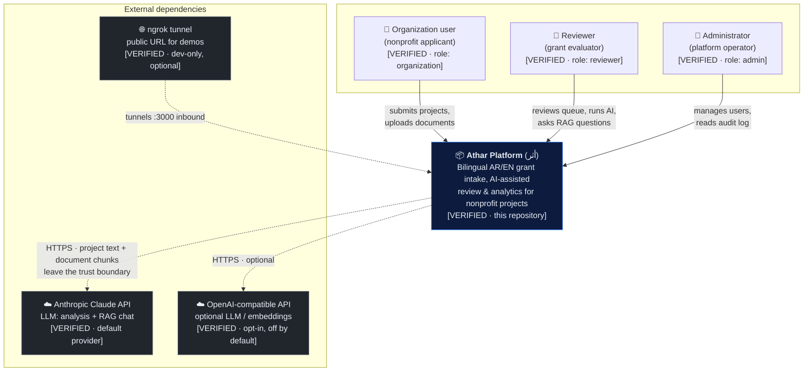
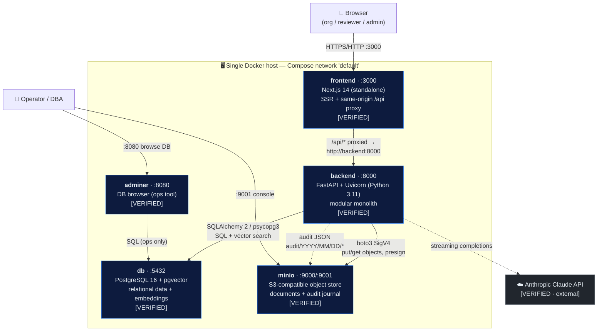
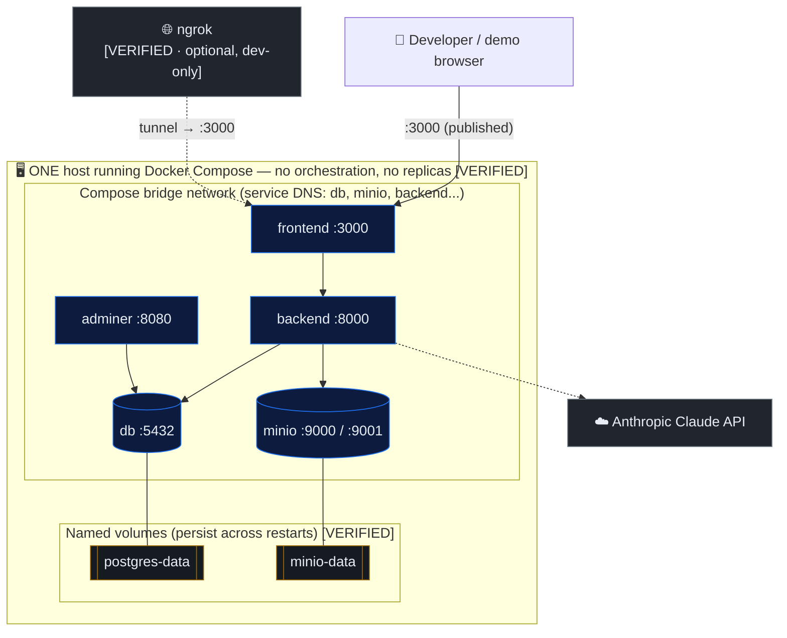

# Athar (أثر) — Current Architecture (Phase 2A)

> **Scope of this document.** This describes the system **as it exists in the
> repository today** — what actually runs when you `docker compose up`. It is
> deliberately *descriptive, not aspirational*. The target AWS production
> architecture is a separate deliverable (Phase 2B) and is **not** covered here.
>
> Every element is tagged so a reader can trust exactly how much to believe it:
>
> | Tag | Meaning |
> |-----|---------|
> | **[VERIFIED]** | Directly present in source / config in this repo. Cited to a file. |
> | **[INFERRED]** | Not written down, but the only reasonable reading of the code/runtime behaviour. |
> | **[NOT IMPLEMENTED]** | A capability a reader might expect that is genuinely absent today. |
> | **[PRODUCTION RECOMMENDATION]** | A forward-looking note. Belongs to the target design, flagged here only to prevent misreading the current state as production-ready. |
>
> Diagrams are provided as **Mermaid** (renders in GitHub, version-controlled,
> source of truth) plus a **Lucid-ready build spec** (structured node / edge /
> group lists) so the polished Lucid C4 diagrams can be generated faithfully
> when the Lucid connector is available.

---

## Legend (applies to all three views)

- **Solid arrow** — synchronous, in-request call.
- **Dashed arrow** — asynchronous / out-of-band (background task, audit ship, external tunnel).
- **`:port`** — a host-published port (reachable from the developer's machine).
- Colours in the Lucid spec: `verified = #1f6feb`, `inferred = #9a6700`,
  `external = #6e7781`, `not-implemented = #cf222e (dashed border)`.

---

## View 1 — Current System Context (C4 Level 1)

**Question this answers:** *Who and what talks to Athar, and where does data
leave the trust boundary?*



### Notes on the context view

- **Three human roles, one enum.** `admin / reviewer / organization` — [VERIFIED]
  `backend/app/models.py::UserRole`. There is no "super-admin", no external
  auditor persona, no anonymous public user; every request is authenticated.
- **The only hard external dependency is the LLM.** With `AI_PROVIDER=anthropic`
  and `ANTHROPIC_API_KEY` set, project text and retrieved document chunks are
  sent to Anthropic — [VERIFIED] `backend/app/services/ai.py`. This is the one
  place applicant data crosses the trust boundary in normal operation.
- **The platform degrades gracefully without AI.** If no key is configured,
  `ai_enabled` is false and analysis rows are marked `failed` with a "not
  configured" message rather than crashing — [VERIFIED]
  `config.py::ai_enabled`, `AIPanel.tsx` handles the disabled state.
- **OpenAI is a genuine alternative path, not dead code** — [VERIFIED]
  `ai.py` selects provider by `settings.ai_provider`; embeddings default to the
  offline `local` hashing embedder so the system needs *only* a Claude key.
- **ngrok is a demo convenience, not architecture** — [VERIFIED · dev-only]
  the same-origin proxy (`frontend/next.config.mjs`) exists so a single tunnel
  to `:3000` works. [NOT IMPLEMENTED] there is no production ingress, CDN, or
  DNS/TLS termination in the repo.

### Lucid-ready build spec — System Context

```yaml
diagram: "Athar — Current System Context (C4 L1)"
actors:
  - id: org        label: "Organization user"      tag: verified   shape: person
  - id: rev        label: "Reviewer"               tag: verified   shape: person
  - id: adm        label: "Administrator"          tag: verified   shape: person
system:
  - id: athar      label: "Athar Platform (أثر)"   tag: verified   shape: rounded-box  note: "This repository"
external_systems:
  - id: anthropic  label: "Anthropic Claude API"   tag: external   shape: box  note: "Default LLM"
  - id: openai     label: "OpenAI-compatible API"  tag: external   shape: box  note: "Optional, off by default"
  - id: ngrok      label: "ngrok tunnel"           tag: external   shape: cloud note: "Dev-only, optional"
edges:
  - {from: org,   to: athar,     label: "submits projects, uploads docs", style: solid}
  - {from: rev,   to: athar,     label: "reviews, runs AI, RAG chat",     style: solid}
  - {from: adm,   to: athar,     label: "manages users, reads audit",     style: solid}
  - {from: athar, to: anthropic, label: "HTTPS · project + chunk text",   style: dashed}
  - {from: athar, to: openai,    label: "HTTPS · optional",               style: dashed}
  - {from: ngrok, to: athar,     label: "tunnels :3000 inbound",          style: dashed}
trust_boundary:
  label: "Athar trust boundary"
  contains: [athar]
  crossings: [anthropic, openai]
```

---

## View 2 — Current Container Architecture (C4 Level 2)

**Question this answers:** *What are the separately-deployable running pieces,
what tech is each, and how do they talk?*



### Notes on the container view

- **Five containers, one host.** `db, minio, backend, adminer, frontend` —
  [VERIFIED] `docker-compose.yml`. No orchestrator, no replicas: exactly one of
  each.
- **The backend is a *modular monolith*, deliberately.** One FastAPI app mounts
  routers `auth, projects, reviews, notifications, admin, analytics` —
  [VERIFIED] `backend/app/main.py`. This is a design choice (low ops overhead
  for a nonprofit), not an accident; it is the single most important thing to
  say correctly to a reviewer.
- **One database does two jobs.** Relational tables *and* vector embeddings live
  in the same PostgreSQL via the `pgvector` extension; retrieval is
  `cosine_distance` top-k over `DocumentChunk.embedding` — [VERIFIED]
  `models.py`, `services/analysis.py::retrieve_context`. No separate vector DB.
- **One object store does two jobs.** MinIO holds both uploaded documents
  (`projects/{id}/...`) and the append-only audit journal
  (`audit/YYYY/MM/DD/*.json`) — [VERIFIED] `services/storage.py`,
  `services/audit.py::_ship_to_s3`. In production this is Amazon S3; the code
  is already SigV4/boto3 and swaps by endpoint URL — [VERIFIED] `config.py`.
- **The frontend is also a small server, not just static files.** Next.js runs
  in `standalone` mode and proxies `/api/*` to `backend:8000`, which is why the
  browser only ever needs one origin — [VERIFIED] `next.config.mjs`,
  `frontend/Dockerfile`.
- **Adminer is an operator tool, not part of the product** — [VERIFIED] it has
  direct DB access on `:8080`. [PRODUCTION RECOMMENDATION] it must **not** be
  exposed in production; it is a local convenience only.
- **AI analysis runs in-process, asynchronously.** Submission returns
  immediately and the analysis pipeline runs via FastAPI `BackgroundTasks` in a
  fresh DB session — [VERIFIED] `api/projects.py::_run_analysis_background`.
  [NOT IMPLEMENTED] there is no external queue/worker (no Celery, SQS, Redis);
  if the process restarts mid-analysis the task is lost. An in-flight guard
  (120 s) prevents stacked duplicate runs — [VERIFIED]
  `services/analysis.py::run_analysis`.

### Container inventory (source-cited)

| Container | Image / build | Port(s) | Tech | Role | Evidence |
|-----------|---------------|---------|------|------|----------|
| frontend | `./frontend` | 3000 | Next.js 14, TS, standalone | UI + same-origin API proxy | `docker-compose.yml`, `next.config.mjs` |
| backend | `./backend` | 8000 | FastAPI 0.115 / Uvicorn / Py3.11 | API, auth, RAG, audit, analytics | `main.py`, `requirements.txt` |
| db | `pgvector/pgvector:pg16` | 5432 | PostgreSQL 16 + pgvector 0.3.6 | Relational + vector store | `docker-compose.yml`, `core/db.py` |
| minio | `minio/minio:latest` | 9000, 9001 | S3-compatible | Documents + audit journal | `docker-compose.yml`, `storage.py` |
| adminer | `adminer:4` | 8080 | PHP DB browser | Ops-only DB inspection | `docker-compose.yml` |

### Lucid-ready build spec — Containers

```yaml
diagram: "Athar — Current Container Architecture (C4 L2)"
boundary:
  label: "Single Docker host — Compose network 'default'"
containers:
  - id: fe       label: "frontend :3000"  tech: "Next.js 14 (standalone)"          tag: verified
  - id: be       label: "backend :8000"   tech: "FastAPI + Uvicorn (Py 3.11)"      tag: verified
  - id: db       label: "db :5432"        tech: "PostgreSQL 16 + pgvector"         tag: verified
  - id: minio    label: "minio :9000/:9001" tech: "S3-compatible object store"     tag: verified
  - id: adminer  label: "adminer :8080"   tech: "DB browser (ops)"                 tag: verified
external:
  - id: anthropic label: "Anthropic Claude API" tag: external
actors:
  - id: user  label: "Browser (org/reviewer/admin)" shape: person
  - id: dev   label: "Operator / DBA"               shape: person
edges:
  - {from: user,    to: fe,        label: "HTTPS/HTTP :3000",              style: solid}
  - {from: fe,      to: be,        label: "/api/* → backend:8000",         style: solid}
  - {from: be,      to: db,        label: "SQLAlchemy2 / psycopg3",        style: solid}
  - {from: be,      to: minio,     label: "boto3 SigV4 objects",           style: solid}
  - {from: be,      to: anthropic, label: "streaming completions",         style: dashed}
  - {from: be,      to: minio,     label: "audit JSON audit/Y/M/D",        style: dashed}
  - {from: adminer, to: db,        label: "SQL (ops)",                     style: solid}
  - {from: dev,     to: adminer,   label: ":8080 browse",                  style: solid}
  - {from: dev,     to: minio,     label: ":9001 console",                 style: solid}
```

---

## View 3 — Current Deployment Architecture

**Question this answers:** *How is this actually run today, what is published to
the network, what persists, and where are the single points of failure?*



### Notes on the deployment view

- **Topology: single host, single instance of everything** — [VERIFIED]
  `docker-compose.yml` (no `deploy.replicas`, no swarm/k8s). This is a
  **development / demo deployment**. Every container is a single point of
  failure; the host itself is the largest SPOF.
- **Published (host-reachable) ports** — [VERIFIED] `docker-compose.yml`:
  `3000` (frontend), `8000` (backend), `8080` (adminer), `9000/9001` (MinIO
  API/console), `5432` (Postgres). [PRODUCTION RECOMMENDATION] in production only
  the ingress port would be public; `5432`, `8080`, `9001`, and the raw MinIO
  API would be private.
- **Internal service discovery is Compose DNS** — [VERIFIED] backend reaches
  `db:5432` and `minio:9000` by service name; the frontend proxies to
  `backend:8000` (`API_PROXY_TARGET`).
- **State persistence** — [VERIFIED] two named volumes: `postgres-data`,
  `minio-data`. These survive `docker compose restart` but are destroyed by
  `docker compose down -v`. [NOT IMPLEMENTED] there are **no backups, no
  snapshots, no point-in-time recovery** — RPO/RTO are undefined today.
- **Schema & seed happen at boot, not via migrations** — [VERIFIED]
  `core/db.py::init_db` runs `CREATE EXTENSION vector` + `Base.metadata.create_all`,
  and `SEED_ON_STARTUP=true` loads demo data. [NOT IMPLEMENTED] **no Alembic
  migrations** — the code itself flags this ("a real deployment would use
  Alembic"). This is the single biggest gap for a real production rollout.
- **Health checks exist for data services only** — [VERIFIED] `db` uses
  `pg_isready`, `minio` uses `mc ready`; `backend` `depends_on` db healthy.
  [NOT IMPLEMENTED] there is no health check on the backend/frontend containers
  themselves and no external uptime monitoring.
- **Security posture of the current deployment** —
  - JWT (HS256) auth + bcrypt password hashing, RBAC via `require_roles`,
    org row-scoping on queries — [VERIFIED] `api/deps.py`, `api/projects.py`.
  - CORS is `allow_origins=["*"]` — [VERIFIED] `main.py`. [PRODUCTION
    RECOMMENDATION] tighten to known origins.
  - Secrets come from env with **insecure dev defaults** (`SECRET_KEY=dev-...`,
    `minioadmin/minioadmin`, seeded demo passwords) — [VERIFIED]
    `docker-compose.yml`. [PRODUCTION RECOMMENDATION] a real secrets manager +
    rotation; no dev defaults.
  - [NOT IMPLEMENTED] **no TLS terminates inside the stack** — HTTP everywhere;
    encryption in transit is expected to come from an external
    proxy/tunnel (ngrok) today.
- **Every API call is audited** — [VERIFIED] `main.py` HTTP middleware writes an
  `AuditLog` row *and* ships a JSON copy to object storage
  (`audit/YYYY/MM/DD/`), stamping `X-Request-ID` — [VERIFIED] `audit.py`.

### Single points of failure (current, honest list)

| SPOF | Impact if it fails | Status |
|------|--------------------|--------|
| Docker host | Entire platform down | [VERIFIED · single host] |
| `db` container / `postgres-data` | Total data + embeddings loss (no backup) | [VERIFIED] / [NOT IMPLEMENTED backups] |
| `minio` container / `minio-data` | Documents + audit journal loss | [VERIFIED] / [NOT IMPLEMENTED backups] |
| `backend` process | API + in-flight AI tasks lost | [VERIFIED · in-process tasks] |
| Anthropic API reachability | AI analysis/chat fail (app still serves) | [VERIFIED · graceful] |

### Lucid-ready build spec — Deployment

```yaml
diagram: "Athar — Current Deployment"
node: "Single Docker host (dev/demo) — Docker Compose, no orchestration"
network: "Compose bridge (service-name DNS)"
published_ports: [3000, 8000, 8080, 9000, 9001, 5432]
containers: [frontend, backend, db, minio, adminer]
volumes:
  - {id: postgres-data, attached_to: db,    tag: verified, note: "no backup"}
  - {id: minio-data,    attached_to: minio, tag: verified, note: "no backup"}
external:
  - {id: anthropic, label: "Anthropic Claude API", tag: external}
  - {id: ngrok,     label: "ngrok tunnel → :3000", tag: external, dev_only: true}
boot_behaviour:
  - "init_db: CREATE EXTENSION vector + create_all (NO Alembic) [VERIFIED]"
  - "SEED_ON_STARTUP=true loads demo org/users/projects [VERIFIED]"
gaps_flagged:
  - {item: "TLS in-stack",        status: not-implemented}
  - {item: "DB migrations",       status: not-implemented}
  - {item: "Backups / RPO / RTO", status: not-implemented}
  - {item: "External queue/worker for AI", status: not-implemented}
  - {item: "App-level health checks + uptime monitoring", status: not-implemented}
  - {item: "Non-default secrets", status: production-recommendation}
```

---

## What this document deliberately does **not** claim

To keep the current-state picture trustworthy, the following are called out as
**absent today** and belong to the target design (Phase 2B onward):

- No cloud/managed services yet — this is Compose on one host. [NOT IMPLEMENTED]
- No horizontal scaling, load balancer, or autoscaling. [NOT IMPLEMENTED]
- No Alembic migrations / schema versioning. [NOT IMPLEMENTED]
- No backups, snapshots, or defined RPO/RTO. [NOT IMPLEMENTED]
- No external job queue for AI; background work is in-process. [NOT IMPLEMENTED]
- No in-stack TLS, WAF, private networking, or secrets manager. [NOT IMPLEMENTED]
- No compliance claim against any specific regulation is made. [INTENTIONAL]

These gaps are **not defects of the demo** — they are exactly the surface the
Phase 2B target architecture will address, and stating them plainly is what
lets the "current vs. target" comparison be credible.
```

## Diagram source-of-truth note

The Mermaid blocks above render directly in GitHub and are the
version-controlled source of truth. The `Lucid-ready build spec` blocks are a
faithful, structured transcription intended to drive polished Lucid C4 diagrams
(System Context, Container, Deployment) with consistent styling once the Lucid
connector is available. No information differs between the two representations.
