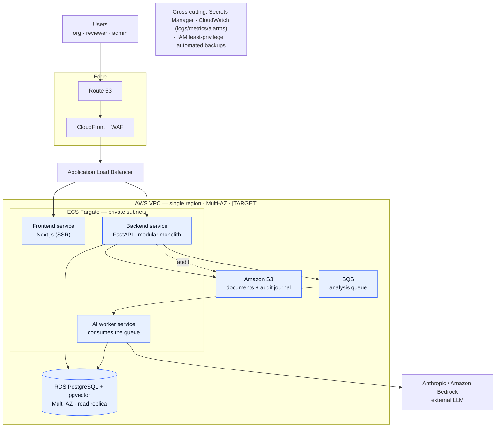

# Athar (أثر) — Target Production Architecture (Phase 2B)

> **Companion to** [`01-current-architecture.md`](./01-current-architecture.md).
> That document describes what runs today (a modular monolith on Docker Compose).
> **This document describes the right-sized production target** for the stated
> scale, rendered as version-controlled **Mermaid** diagrams.
>
> **Scale assumption (the brief):** ~10,000 registered users/orgs, up to ~1,000
> concurrent at peak; moderate, bursty document volume; ~99.9% availability;
> realistic **single region, Multi-AZ** (no multi-region without a clear business
> requirement); cost-optimised for a nonprofit. **Deliberately not
> over-engineered for hyperscale** — managed AWS services are preferred where
> they reduce operational load, and nothing is added just to look sophisticated.
>
> **Tagging** (same contract as doc 01):
>
> | Tag | Meaning |
> |-----|---------|
> | **[VERIFIED]** | True of the code in this repo today. |
> | **[TARGET]** | Part of the production design; **not implemented yet**. |
> | **[RECOMMENDATION]** | A judgement call, stated as such. |
>
> No AWS infrastructure described here exists yet. Nothing claims the platform
> *is* compliant with any regulation — only that it is *designed to support* the
> named controls.

---

## 1. Target deployment — modular monolith on ECS Fargate

The backend stays a **modular monolith** — **[VERIFIED]** today — and is run as a
**serverless container on ECS Fargate**: no cluster to manage, autoscaling,
Multi-AZ. The only piece split out is the **async AI worker** (same codebase,
triggered by a queue), because AI analysis is slow and bursty and must scale
independently of the request path.



**Node roles** — all **[TARGET]**:

| Component | Role |
|-----------|------|
| Route 53 · CloudFront · WAF | DNS, CDN, edge protection (rate rules, OWASP, bot control) |
| ALB | TLS termination + routing into the Fargate services |
| ECS Fargate — Frontend | Next.js SSR container (keeps the same-origin `/api` proxy — **[VERIFIED]**) |
| ECS Fargate — Backend | FastAPI **modular monolith** (the request path) |
| ECS Fargate — AI worker | Consumes SQS, runs extract · embed · retrieve · Claude · persist |
| RDS PostgreSQL + pgvector | Relational **and** vector store in one engine, Multi-AZ |
| Amazon S3 | Documents (`projects/…`) + append-only audit journal (`audit/Y/M/D`) |
| SQS | Decouples the slow AI work from submission |
| Anthropic / Bedrock | External LLM (Bedrock preferred if in-region residency is needed) |

---

## 2. Why this shape (right-sized, not under-built)

- **Modular monolith on Fargate, not microservices/EKS** — **[RECOMMENDATION]**
  At 10k users / 1k concurrent, one deployable with clean module boundaries is
  the correct call: lowest ops, no cluster to run, and it autoscales. The
  boundaries are already drawn (the FastAPI routers), so a service can be
  extracted later *if* a real need appears — but not pre-emptively.
- **One database does two jobs** — pgvector keeps relational data and embeddings
  in a single RDS instance. No separate vector DB to run, back up, or keep in
  sync. Fine well past this scale.
- **One object store does two jobs** — S3 holds documents and the audit journal.
  The code already speaks S3 (SigV4) — **[VERIFIED]** — so MinIO → S3 is an
  endpoint swap, not a rewrite.
- **SQS + one worker for async** — the only decomposition that earns its keep:
  it makes submission fast and lets the slow LLM work retry and scale on its own.

---

## 3. Current → target mapping

| Concern | Today — **[VERIFIED]** | Target — **[TARGET]** |
|---------|------------------------|------------------------|
| Compute | docker-compose, one host | **ECS Fargate**, autoscaled, Multi-AZ |
| Frontend | Next.js container (compose) | Next.js Fargate service behind CloudFront |
| Database | Postgres container + volume | **RDS PostgreSQL Multi-AZ** + automated backups |
| Vectors | pgvector | pgvector in RDS (unchanged — right for this scale) |
| Object storage | MinIO | **Amazon S3** (versioned + lifecycle) |
| Async AI | in-process `BackgroundTask` | **SQS + Fargate worker** (retries, DLQ) |
| Auth | custom JWT + bcrypt + app RBAC | same, hardened (**[RECOMMENDATION]** Cognito optional, not required) |
| Schema | `create_all` on boot | **Alembic** migrations in CI/CD |
| Secrets / TLS | dev defaults, proxy TLS | **Secrets Manager** + ACM + WAF |
| Observability | logs to stdout | **CloudWatch + X-Ray**, X-Request-ID correlation, alarms |
| Edge | none | **CloudFront + WAF** rate limiting |

---

## 4. Async analysis flow (target)

```mermaid
sequenceDiagram
    participant U as Org user
    participant API as Backend (Fargate)
    participant Q as SQS
    participant W as AI worker (Fargate)
    participant DB as RDS + pgvector
    participant S3 as S3
    participant LLM as Claude / Bedrock

    U->>API: submit project
    API->>DB: persist project (status = submitted)
    API->>Q: enqueue "analyze project X"
    API-->>U: 202 accepted (returns immediately)
    Q->>W: deliver message
    W->>DB: read project + chunks
    W->>DB: retrieve top-k (cosine)
    W->>LLM: analyze (streaming)
    LLM-->>W: structured scorecard
    W->>DB: persist analysis (status = completed)
    W->>S3: write audit record
    Note over Q,W: failures retry via visibility timeout;<br/>poison messages go to a dead-letter queue
```

---

## 5. Scalability · reliability · observability (targets)

All **[TARGET]** unless noted.

**Scalability**
- Stateless Fargate services, **auto-scaled** on CPU/request metrics.
- **RDS read replica** for reporting/dashboard reads.
- **Connection pooling** (RDS Proxy / PgBouncer) so bursts don't exhaust the DB.
- **CloudFront** caching for static assets.

**Reliability**
- **Multi-AZ RDS** with automatic failover.
- **Automated backups** (RPO in minutes) — RPO/RTO defined as production targets.
- Container **health checks**; retries with backoff on transient errors.
- **SQS dead-letter queue** for failed analyses.
- **Graceful AI degradation** — the app serves fully even with no LLM key — **[VERIFIED]**.

**Observability**
- **CloudWatch** metrics & logs; **X-Ray** tracing.
- **X-Request-ID** correlation across the stack — **[VERIFIED]** (middleware today).
- Append-only **audit trail** — **[VERIFIED]** (Postgres + object store).
- **Alarms** routed to on-call.

---

## 6. Security & auth (targets)

- **Authentication** stays the app's **JWT + bcrypt** — **[VERIFIED]**; hardened in
  production (rotated `SECRET_KEY` via Secrets Manager, scoped CORS).
  **[RECOMMENDATION]** Amazon Cognito for authN + MFA is a *reasonable option* if
  managed identity is wanted, keeping RBAC/org-scoping in the app — but **not
  required** at this scale.
- **Authorization** — RBAC (`admin/reviewer/organization`) + org row-scoping stay
  in the app — **[VERIFIED]**.
- **Encryption** — at rest via KMS, TLS 1.2+ in transit — **[TARGET]**.
- **Secrets** — Secrets Manager, no dev defaults — **[TARGET]**.
- **Network** — private subnets, no public database, least-privilege IAM,
  WAF at the edge — **[TARGET]**.
- **Audit** — every API call already logged — **[VERIFIED]**; store the journal in
  S3 with versioning (Object Lock/WORM if tamper-evidence is required) — **[TARGET]**.

---

## 7. Honest caveats

- This is the **right-sized 10k target**, on purpose. If the scale requirement
  ever grows to millions, the next steps would be a separate exercise (managed
  vector store, sharding/Aurora, an event backbone, multi-region) — deliberately
  **out of scope** here.
- **No compliance certification is claimed.** Security items are design intents.
- **No AWS infrastructure is implemented yet** — this is the target, distinct
  from the current implementation in doc 01.

> Diagrams above are Mermaid and render directly on GitHub — the
> version-controlled source of truth for the target architecture.
