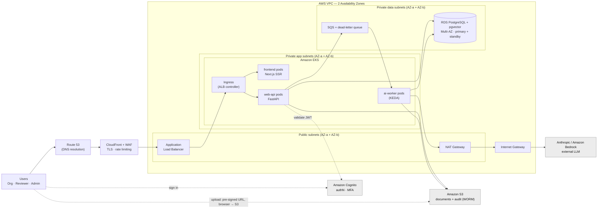

# Athar (أثر) — Target Architecture: EKS / Scale Variant (corrected)

> **This is the EKS + microservices variant**, a corrected version of the
> hand-drawn diagram. It is the *scale-oriented* option — heavier than the 10k
> brief strictly needs. The **right-sized default remains**
> [`02-target-architecture.md`](./02-target-architecture.md) (ECS Fargate, 10k).
> Keep whichever you choose as canonical; this file exists so the EKS option is
> correct and version-controlled if you go that way.
>
> Tags: **[TARGET]** everything here (no AWS infra exists yet).

---

## Corrected EKS architecture

---

## What changed vs the hand-drawn diagram

| # | Issue in the draft | Fix applied here |
|---|--------------------|------------------|
| 1 | **ALB → Anthropic** (LLM called via the load balancer) | Removed. The LLM is called **outbound from `ai-worker` pods** → NAT → IGW → Anthropic. |
| 2 | **No egress path** for private pods | Added **NAT Gateway** (public subnet) + **Internet Gateway**. |
| 3 | **Single AZ** | Public / app / data subnets now span **2 AZs**; **RDS is Multi-AZ** (primary + standby). |
| 4 | **No edge protection** | Added **CloudFront + WAF** (TLS, rate limiting) in front of the ALB. |
| 5 | **SQS had no consumer** | Added a distinct **`ai-worker`** deployment consuming SQS, with a **DLQ**. |
| 6 | **S3 not wired** | `web-api` and `ai-worker` now write to **S3** (documents + audit). |
| 7 | **No auth** | Added **Cognito** (authN + MFA); `web-api` validates the JWT. |
| 8 | **Upload path missing** | Added **pre-signed S3 upload** (browser → S3 direct) so bulk uploads never slam the API/DB. |
| 9 | **Route 53 as an inline hop** | Relabelled as **DNS resolution** (it resolves the name to the ALB; not a data-plane proxy). |
| 10 | **Pods labelled unit1/2/3** | Labelled with real services: **frontend / web-api / ai-worker**. |
| 11 | **RDS floating, single** | Placed in **private data subnets**, marked **Multi-AZ + pgvector**. |

---

## Notes & recommendations

- **LLM egress — two options.** Shown via **NAT → IGW → Anthropic** (public internet
  egress). **[RECOMMENDATION]** For stricter security / data residency, call
  **Amazon Bedrock through a VPC interface endpoint (PrivateLink)** instead — the
  call never leaves AWS's network and no NAT is needed for it.
- **VPC endpoints.** Add a **Gateway endpoint for S3** (keeps document/audit
  traffic off the internet) and interface endpoints for Secrets Manager / ECR /
  CloudWatch as needed.
- **Cross-cutting (not drawn, assumed):** Secrets Manager, CloudWatch + X-Ray,
  IAM least-privilege, security groups per tier, automated RDS backups.
- **Autoscaling:** HPA/**KEDA** for `ai-worker` on queue depth; **Karpenter** for
  node scaling.

---

## Which target is canonical?

- **[`02-target-architecture.md`]** — ECS Fargate, modular monolith, **10k** — the
  right-sized default per the brief.
- **This file** — EKS + microservices — the scale/showcase option.

They are mutually exclusive as a "target." Pick one to carry into the Figma deck;
the other stays as a documented alternative. My recommendation for the stated 10k
scale remains the ECS Fargate design — this EKS variant is here, and now correct,
for when the scale story calls for it.
